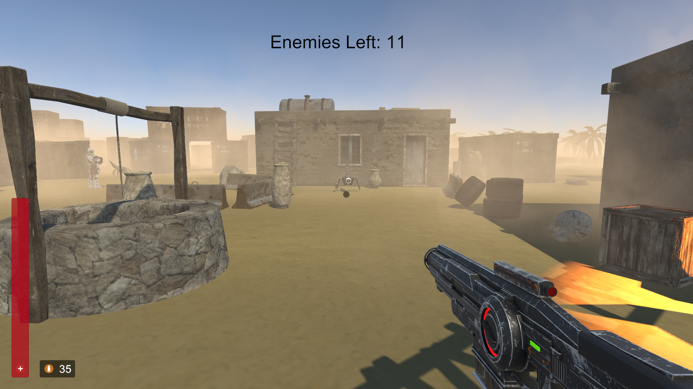

# dusk
This was the first game that I made in unity. You can move around the map and shoot at enemies, thats about it. 

# Usage
- WASD for movement
- space to jump
- hold shift to speed up
- E to throw a grenade
- There are two guns you can switch between them using 1 and 2 keys

# Screenshots

